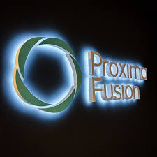
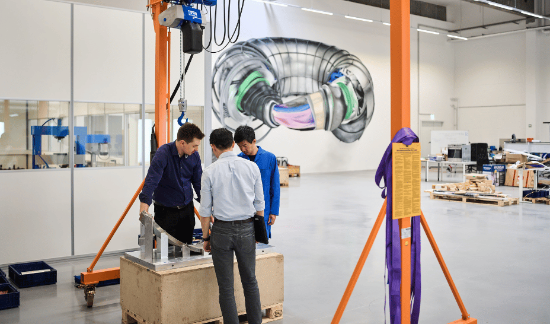

Here you will find the schedule and abstracts for the OSSFE 2026 conference

---
# Tuesday
## 🎉 Welcome statement: 08:40 - 09:00

Room: Auditorium

Presenter: Remi Delaporte-Mathurin

---

## Plenary Session 1: 09:00 - 10:00

Room: Auditorium

*Chair*: TBC, Affiliation

Number of presentations: 2

| &nbsp; ID   | &nbsp; Title                                                                   | &nbsp; Presenter   | &nbsp; Organisation   |
|:------------|:-------------------------------------------------------------------------------|:-------------------|:----------------------|
| P1          | [Open Source License Compliance - Trust, Tips, Trends](abstracts/yagi-open.md) | Martin Yagi        | First Light Fusion    |
| P2          | [Free Function API for CadQuery](abstracts/urbańczyk-free.md)                  | Adam Urbańczyk     | CadQuery              |

---

## ☕ Break: 10:00 - 10:20

Coffee, tea refreshments and pastries will be served in the Foyer.

---

## Sessions: 10:20 - 11:20

### Oral Session A

Room: Auditorium

*Chair*: TBC, Affiliation

Number of presentations: 3

| &nbsp; ID   | &nbsp; Title                                                                                                                 | &nbsp; Presenter   | &nbsp; Organisation                  |
|:------------|:-----------------------------------------------------------------------------------------------------------------------------|:-------------------|:-------------------------------------|
| A1          | [Probabilistic characterisation of neutron spectra with the nFoils package](abstracts/butt-probabilistic.md)                 | Louis Butt         | University of Birmingham             |
| A2          | [Gaussian Processing Framework for Neutron Generator Diagnostics and Uncertainty Quantification](abstracts/dunn-gaussian.md) | Collin Dunn        | MIT Plasma Science and Fusion Center |
| A3          | [Summary of V&V efforts for OpenMC](abstracts/shimwell-summary.md)                                                           | Jonathan Shimwell  | Proxima Fusion                       |

### Oral Session B

Room: Projektraum

*Chair*: TBC, Affiliation

Number of presentations: 3

| &nbsp; ID   | &nbsp; Title                                                                                          | &nbsp; Presenter    | &nbsp; Organisation                  |
|:------------|:------------------------------------------------------------------------------------------------------|:--------------------|:-------------------------------------|
| B1          | [The IAEA Fusion Data Lake Project - Progress, Prototype, and the Path Ahead](abstracts/gahle-the.md) | Daljeet Singh Gahle | International Atomic Energy Agency   |
| B2          | [A comparison of open source data distribution tools for global data sharing](abstracts/dixon-a.md)   | Stephen Dixon       | UKAEA                                |
| B3          | [Open-source MDSplus and Trends in Fusion Data](abstracts/stillerman-open.md)                         | Joshua Stillerman   | MIT Plasma Science and Fusion Center |

### 🛠️ Tutorial Session 1

Room: Seminar room 1

A series of tutorials will be available to attend for the following packages:

Number of tutorials: 2

| &nbsp; ID   | &nbsp; Title                                                                                                               | &nbsp; Presenter   | &nbsp; Organisation                     |
|:------------|:---------------------------------------------------------------------------------------------------------------------------|:-------------------|:----------------------------------------|
| T1          | [Struphy 3.0 - Using Python for HPC Plasma Modeling](abstracts/possanner-struphy.md)                                       | Stefan Possanner   | Max Planck Institute for Plasma Physics |
| T2          | [Tutorial: an introduction to the Gkeyll simulation framework for both research and education](abstracts/juno-tutorial.md) | James Juno         | Princeton Plasma Physics Laboratory     |

---

## 🖼️  Poster Session: 11:20 - 12:20

A full list of the posters and their abstracts can be found in the [List of posters](list_of_posters.md)

---

## 🍽️ Lunch break: 12:20 - 13:40

Lunch is provided in the Munich Urban Colab restaurant (ground floor) for all conference attendees.

---

## 🗣️ Panel Session: 13:40 - 14:40

Room: Auditorium

*Chair*: TBC, Affiliation

A panel session will be held with the following members:
| Presenter                          | Affiliation   |
|:-----------------------------------|:--------------|
| [Stephen Coleman](bios/coleman.md) | RadiaSoft LLC |
| [Zach Hynek](bios/hynek.md)        | Morton Labs   |

---

## Sessions: 14:40 - 15:40

### Oral Session C

Room: Auditorium

*Chair*: TBC, Affiliation

Number of presentations: 3

| &nbsp; ID   | &nbsp; Title                                                                                                                                   | &nbsp; Presenter   | &nbsp; Organisation   |
|:------------|:-----------------------------------------------------------------------------------------------------------------------------------------------|:-------------------|:----------------------|
| C1          | [Constraining Equilibria with Toroidal Harmonics in the Bluemira Design Framework](abstracts/mould-constraining.md)                            | Clair Mould        | UKAEA                 |
| C2          | [Exploring fusion power plant trade-offs with FUSE: An open-source multi-objective optimization framework](abstracts/slendebroek-exploring.md) | Tim Slendebroek    | UCSD                  |
| C3          | [FUSE Integrated Modeling Framework for FPP design, Scenario Optimization and Model Validation](abstracts/neiser-fuse.md)                      | Tom Neiser         | General Atomics       |

### Oral Session D

Room: Projektraum

*Chair*: TBC, Affiliation

Number of presentations: 3

| &nbsp; ID   | &nbsp; Title                                                                                                                                                                                        | &nbsp; Presenter   | &nbsp; Organisation   |
|:------------|:----------------------------------------------------------------------------------------------------------------------------------------------------------------------------------------------------|:-------------------|:----------------------|
| D1          | [The FEniCS Finite Element framework: introduction and applications in nuclear fusion simulations](abstracts/leoni-the.md)                                                                          | Massimiliano Leoni | Proxima Fusion        |
| D2          | [Automatic Differentiation for CAD](abstracts/asseily-automatic.md)                                                                                                                                 | Max Asseily        | Proxima Fusion        |
| D3          | [Overview of the capabilities in the Multiphysics Object Oriented Simulation Environment and recent activities in modeling and simulation for fusion energy systems](abstracts/dechant-overview.md) | Corey DeChant      | INL                   |

### 🛠️ Tutorial Session 2

Room: Seminar room 1

A series of tutorials will be available to attend for the following packages:

Number of tutorials: 2

| &nbsp; ID   | &nbsp; Title                                                                                | &nbsp; Presenter   | &nbsp; Organisation   |
|:------------|:--------------------------------------------------------------------------------------------|:-------------------|:----------------------|
| T3          | [Getting started with IMAS open-source: a beginner’s tutorial](abstracts/hoenen-getting.md) | Olivier Hoenen     | ITER Organization     |

---

## ☕ Break: 15:40 - 16:00

Coffee, tea refreshments and pastries will be served in the Foyer.

---

## Sessions: 16:00 - 17:00

### Oral Session E

Room: Auditorium

*Chair*: TBC, Affiliation

Number of presentations: 3

| &nbsp; ID   | &nbsp; Title                                                                                                                                                    | &nbsp; Presenter   | &nbsp; Organisation               |
|:------------|:----------------------------------------------------------------------------------------------------------------------------------------------------------------|:-------------------|:----------------------------------|
| E1          | [Modeling Permeator Probe for Tritium Concentration in Liquids](abstracts/dunnell-modeling.md)                                                                  | Kaelyn Dunnell     | MIT PSFC                          |
| E2          | [Toward ParaTAN–FESTIM Coupling: An MBSE-Oriented Open-Source Workflow for Neutronics and Tritium Transport in Mirror Fusion Devices](abstracts/shah-toward.md) | Hitarth Shah       | University of Wisconsin - Madison |
| E3          | [Uncertainty Quantification Tools for Lithium Ceramics-based Tritium Breeding Module](abstracts/yudin-uncertainty.md)                                           | Yehor Yudin        | Bangor University                 |

### Oral Session F

Room: Projektraum

*Chair*: TBC, Affiliation

Number of presentations: 3

| &nbsp; ID   | &nbsp; Title                                                                                                                           | &nbsp; Presenter   | &nbsp; Organisation   |
|:------------|:---------------------------------------------------------------------------------------------------------------------------------------|:-------------------|:----------------------|
| F1          | [DESC Stellarator Equilibrium and Optimization Code](abstracts/kadz-desc.md)                                                           | Lee Kadz           | Princeton University  |
| F2          | [ConStellaration: A dataset of QI-like stellarator plasma boundaries and optimization benchmarks](abstracts/cadena-constellaration.md) | Santiago Cadena    | Proxima Fusion        |
| F3          | [Simsopt: A flexible framework for stellarator optimisation](abstracts/smiet-simsopt.md)                                               | Chris Smiet        | EPFL                  |

### 🛠️ Tutorial Session 3

Room: Seminar room 1

A series of tutorials will be available to attend for the following packages:

Number of tutorials: 2

| &nbsp; ID   | &nbsp; Title                                                                                                                           | &nbsp; Presenter   | &nbsp; Organisation              |
|:------------|:---------------------------------------------------------------------------------------------------------------------------------------|:-------------------|:---------------------------------|
| T5          | [Modular Tokamak Design and Simulation Open Source Framework](abstracts/zhurba-modular.md)                                             | Alexei Zhurba      | Next Step Fusion                 |
| T6          | [TokaLab: A Modular Virtual Tokamak Laboratory for Education, FAIR Principles, and Algorithm Benchmarking](abstracts/rossi-tokalab.md) | Riccardo Rossi     | "Tor Vergata" University of Rome |

---

# Wednesday
## Plenary Session 2: 09:00 - 10:00

Room: Auditorium

*Chair*: TBC, Affiliation

Number of presentations: -46

| &nbsp; ID   | &nbsp; Title                                                       | &nbsp; Presenter   | &nbsp; Organisation     |
|:------------|:-------------------------------------------------------------------|:-------------------|:------------------------|
| P3          | [Solving fusion problems in FEniCSx](abstracts/dean-solving.md)    | Joseph Dean        | University of Cambridge |
| P4          | [Fusion & Nuclear Engineering at scale](abstracts/davis-fusion.md) | Andrew Davis       | UKAEA                   |

---

## ☕ Break: 10:00 - 10:20

Coffee, tea refreshments and pastries will be served in the Foyer.

---

## Sessions: 10:20 - 11:20

### Oral Session G

Room: Auditorium

*Chair*: TBC, Affiliation

Number of presentations: 3

| &nbsp; ID   | &nbsp; Title                                                                                                                                  | &nbsp; Presenter             | &nbsp; Organisation     |
|:------------|:----------------------------------------------------------------------------------------------------------------------------------------------|:-----------------------------|:------------------------|
| G1          | [Deep Learning–Based Surrogate Models and RL Control for Extreme Vacuum Environments in Fusion Research](abstracts/rodríguezllorente-deep.md) | Guillermo Rodríguez Llorente | HI Iberia               |
| G2          | [Pellet Fueling: AI-Enhanced Surrogate Model HPI2-NN and Integrated Modelling](abstracts/paneraalvarez-pellet.md)                             | Alex Panera Alvarez          | DIFFER                  |
| G3          | [An ML-based design approach for Fusion Energy components](abstracts/perumal-an.md)                                                           | Vignesh Perumal              | UHV3D, Inc. dba CAMINNO |

### Oral Session H

Room: Projektraum

*Chair*: TBC, Affiliation

Number of presentations: 3

| &nbsp; ID   | &nbsp; Title                                                                                                                                               | &nbsp; Presenter   | &nbsp; Organisation                             |
|:------------|:-----------------------------------------------------------------------------------------------------------------------------------------------------------|:-------------------|:------------------------------------------------|
| H1          | [ Integration of Open-Source Fusion Codes into Commercial Design Workflows](abstracts/acharya-integration.md)                                              | Sunil  Acharya     | Ansys Inc                                       |
| H2          | [Extending FLUNED with OpenMC Capabilities for Coupled CFD–Neutronics Simulation of Activated Coolants in Fusion Systems](abstracts/depietri-extending.md) | Marco De Pietri    | MIT-PSFC                                        |
| H3          | [foamForNuclear: A Modular Multiphysics Platform for Fusion and Fission Applications](abstracts/nervi-foamfornuclear.md)                                   | Giovanni Nervi     | EPFL – École polytechnique fédérale de Lausanne |

### 🛠️ Tutorial Session 4

Room: Seminar room 1

A series of tutorials will be available to attend for the following packages:

Number of tutorials: 2

| &nbsp; ID   | &nbsp; Title                                                                                                                        | &nbsp; Presenter        | &nbsp; Organisation   |
|:------------|:------------------------------------------------------------------------------------------------------------------------------------|:------------------------|:----------------------|
| T7          | [PathSim: An Open-Source Python Framework for Dynamic System Simulation in Fusion Energy Applications](abstracts/rother-pathsim.md) | Milan Rother            | independent           |
| T8          | [PathView: a graphical interface for system modelling (using PathSim)](abstracts/delaporte-mathurin-pathview.md)                    | Remi Delaporte-Mathurin | MIT                   |

---

## 🖼️  Poster Session: 11:20 - 12:20

A full list of the posters and their abstracts can be found in the [List of posters](list_of_posters.md)

---

## 🍽️ Lunch break: 12:20 - 13:40

Lunch is provided in the Munich Urban Colab restaurant (ground floor) for all conference attendees.

---

## Plenary Session 3: 13:40 - 14:40

Room: Auditorium

*Chair*: TBC, Affiliation

Number of presentations: -46

| &nbsp; ID   | &nbsp; Title                                                                            | &nbsp; Presenter   | &nbsp; Organisation   |
|:------------|:----------------------------------------------------------------------------------------|:-------------------|:----------------------|
| P5          | [Introducing the BLUEMIRA fusion reactor design tool](abstracts/coleman-introducing.md) | Matti Coleman      | UKAEA                 |
| P6          | [IMAS-compatible components of a digital twin environment](abstracts/vanvugt-imas.md)   | Daan van Vugt      | Ignition Computing    |

---

## Sessions: 14:40 - 15:40

### Oral Session I

Room: Auditorium

*Chair*: TBC, Affiliation

Number of presentations: 3

| &nbsp; ID   | &nbsp; Title                                                                                                             | &nbsp; Presenter   | &nbsp; Organisation                 |
|:------------|:-------------------------------------------------------------------------------------------------------------------------|:-------------------|:------------------------------------|
| I1          | [An Open-Source Divertor Digital Twin Environment for Fusion Power Plants](abstracts/battye-an.md)                       | Michael Battye     | University of York                  |
| I2          | [Using Gkeyll as a self-consistent gyrokinetic predictive tool for tokamak edge turbulence](abstracts/hoffmann-using.md) | Antoine Hoffmann   | Princeton Plasma Physics Laboratory |
| I3          | [GSFit: Grad-Shafranov Fit – A new equilibrium reconstruction code for tokamak plasmas](abstracts/buxton-gsfit.md)       | Peter Buxton       | Tokamak Energy Ltd.                 |

### Oral Session J

Room: Projektraum

*Chair*: TBC, Affiliation

Number of presentations: 3

| &nbsp; ID   | &nbsp; Title                                                                                                                     | &nbsp; Presenter    | &nbsp; Organisation                     |
|:------------|:---------------------------------------------------------------------------------------------------------------------------------|:--------------------|:----------------------------------------|
| J1          | [FAIR and Flexible: Fusion Data Mapping with TokaMap and libTokaMap](abstracts/hollocombe-fair.md)                               | Jonathan Hollocombe | UKAEA                                   |
| J2          | [Comparing APIs for semi-Lagrangian and particle-in-cell methods](abstracts/schild-comparing.md)                                 | Nils Schild         | Max Planck Institute for Plasma Phyiscs |
| J3          | [DECIMA: Open-Source AI-assisted analysis of MCNP PTRAC files for neutronics in fusion and fission](abstracts/ducasse-decima.md) | Quentin Ducasse     | ASNR                                    |

### 🛠️ Tutorial Session 5

Room: Seminar room 1

A series of tutorials will be available to attend for the following packages:

Number of tutorials: 2

| &nbsp; ID   | &nbsp; Title                                                                                             | &nbsp; Presenter   | &nbsp; Organisation     |
|:------------|:---------------------------------------------------------------------------------------------------------|:-------------------|:------------------------|
| T9          | [Overview of the FESTIM Workshop: Applications and Tutorial Introduction](abstracts/khurana-overview.md) | Chirag Khurana     | MIT PSFC                |
| T10         | [A FEniCS tutorial: finite element notebooks](abstracts/richardson-a.md)                                 | Chris Richardson   | University of Cambridge |

---

## ☕ Break: 15:40 - 16:00

Coffee, tea refreshments and pastries will be served in the Foyer.

---

## Sessions: 16:00 - 17:00

### Oral Session K

Room: Auditorium

*Chair*: TBC, Affiliation

Number of presentations: 3

| &nbsp; ID   | &nbsp; Title                                                                                                                                | &nbsp; Presenter       | &nbsp; Organisation                         |
|:------------|:--------------------------------------------------------------------------------------------------------------------------------------------|:-----------------------|:--------------------------------------------|
| K1          | [Is there a space for freelancer in scientific open source development](abstracts/mouginot-is.md)                                           | Baptiste Mouginot      | BaM Scientific Consulting                   |
| K2          | [Using open-source tools and platforms to build a multi-tenant development environment for fusion research](abstracts/pogodziński-using.md) | Bartłomiej Pogodziński | Poznan Supercomputing and Networking Center |
| K3          | [Forecasting Fusion’s Role in the Marketplace of Tomorrow](abstracts/bullowsweeks-forecasting.md)                                           | Hugo Bullows Weeks     | Fusion Advisory Services                    |

### Oral Session L

Room: Projektraum

*Chair*: TBC, Affiliation

Number of presentations: 3

| &nbsp; ID   | &nbsp; Title                                                                                                                     | &nbsp; Presenter   | &nbsp; Organisation                                                                  |
|:------------|:---------------------------------------------------------------------------------------------------------------------------------|:-------------------|:-------------------------------------------------------------------------------------|
| L1          | [PROCESS Systems Code and its use in the STEP Concept Design Workflow](abstracts/ashe-process.md)                                | Christopher Ashe   | UKIFS                                                                                |
| L2          | [SOLPS-NN: Neural Networks for Scrape-Off Layer Simulations](abstracts/dasbach-solps.md)                                         | Stefan Dasbach     | DIFFER - Dutch Institute for Fundamental Energy Research, Eindhoven, the Netherlands |
| L3          | [Latest Developments in TORAX: A Differentiable Simulator for Fusion Pulse Planning and Optimization](abstracts/hamel-latest.md) | Philippe Hamel     | Google Deepmind                                                                      |

### 🛠️ Tutorial Session 6

Room: Seminar room 1

A series of tutorials will be available to attend for the following packages:

Number of tutorials: 2

| &nbsp; ID   | &nbsp; Title                                                                                                                               | &nbsp; Presenter   | &nbsp; Organisation                     |
|:------------|:-------------------------------------------------------------------------------------------------------------------------------------------|:-------------------|:----------------------------------------|
| T11         | [GVEC - a flexible 3D MHD equilibrium solver](abstracts/babin-gvec.md)                                                                     | Robert Babin       | Max Planck Institute for Plasma Physics |
| T12         | [The Open FUSION Toolkit: An open-source suite of fusion modeling tools for engineering, analysis, and education](abstracts/hansen-the.md) | Chris Hansen       | Columbia University                     |

---

## 🏆 Awards ceremony and closing remarks: 17:10 - 17:20

Room: Auditorium

Presenter: Remi Delaporte-Mathurin

---

# Thursday 
## 🚶 Proxima Fusion tour: 09:30 - 10:00

|  |  |
|---|---|
|  |  |

Join us for an optional social event and get a behind-the-scenes look at Proxima Fusion's facilities.

---

## ☕ Break: 10:00 - 10:20

Coffee, tea refreshments and pastries will be served in the Foyer.

---

## 🖳 OSSFE Hackathon: 10:20 - 12:20

An optional add-on event for conference attendees. 
This will be an oppertunity to interact work together with open-source developers on projects of interest and see the
contiribution process first-hand.

*Structure and details to be announced*

---

## 🍽️ Lunch break: 12:20 - 13:40

Lunch is provided in the Proxima Fusion office for all Hackathon attendees.

---

