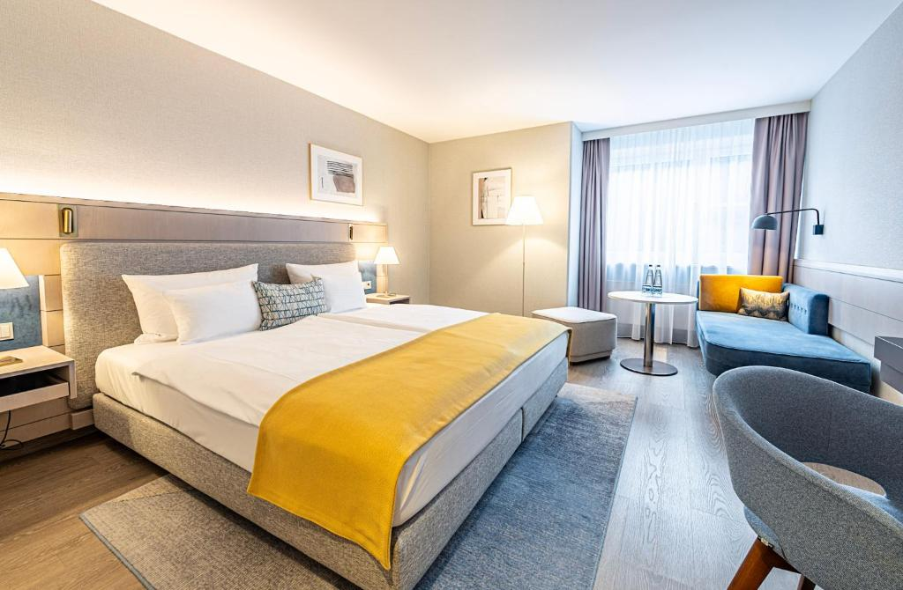

---

# Register for OSSFE 2026
We are excited to welcome you to the Open Source Software for Fusion Energy (OSSFE) Conference 2026! 

Get tickets at: ossfe2026.eventbrite.com

If you have any questions regarding the registration process, feel free to reach out to us at ossfecontact@gmail.com.

---

# Sponsored student registrations

We have a limited number of free admissions for students thanks to our sponsors.

If you are interested in a chance to win a ticket please fill in [this form](https://docs.google.com/forms/d/e/1FAIpQLScOLtUfAEncQ6C0y8faCQozXPy0RxdpBmraPdY_0gATkq612g/viewform?usp=dialog)

---

# Local Accommodation

We have arranged special rates with local hotels for conference attendees. Please note: availability is limited.

## Hotel Europa München****

**Address**: [Google maps link](https://maps.app.goo.gl/AQsvX77eZdkGqHUd8)

**Distance from Munich Urban Colab**: 650m

**Rate**: €126.00 per room, per night (March 10-12, 2026)

Includes breakfast, service, and taxes. Minimum 2-night stay.

**To Book**:
 - Contact the hotel directly
 - Use booking code: OSSFE
 - Booking deadline: January 16th, 2026
 - Cancellation: Free cancellation up to 7 days before arrival

Find more on their [website](https://hotel-europa.de/en/)
