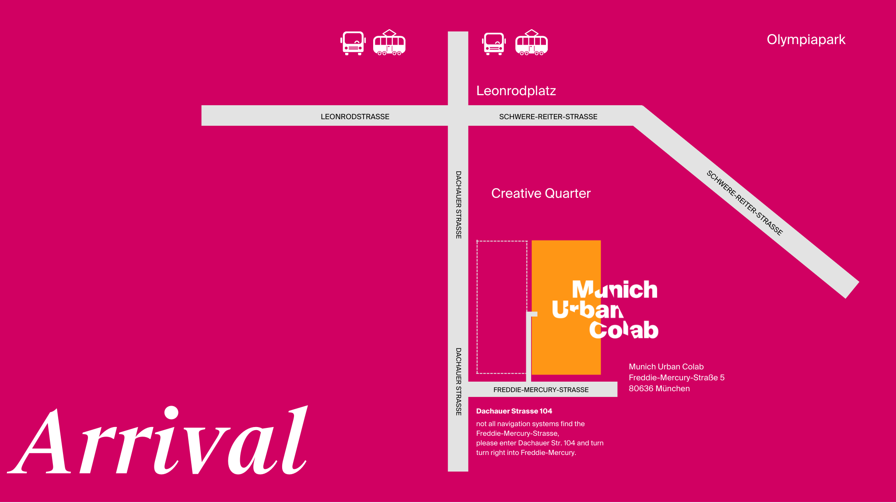
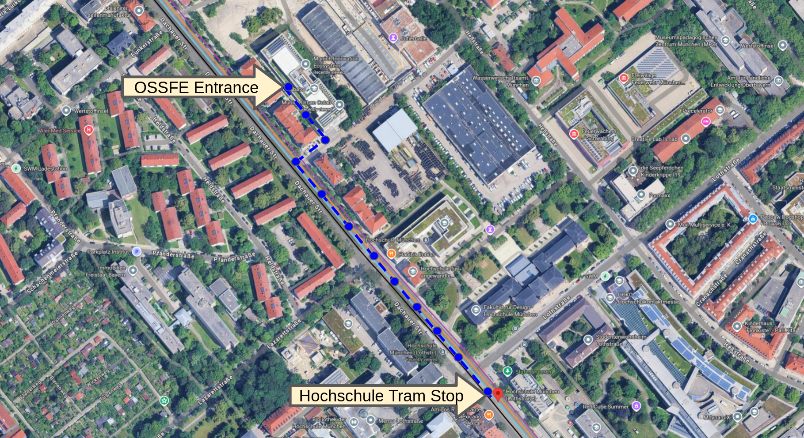

OSSFE 2026 is held at the [Munich Urban Colab](https://www.munich-urban-colab.de) on March 10th - 12th, 2026.

The venue is easy to access with public transport and close to the Hochschule tram stop on line 20/21.

The conference has an individual entrance for the event accessible from the south west side of the building which is a short walk from the tram Hochschule tram stop.

